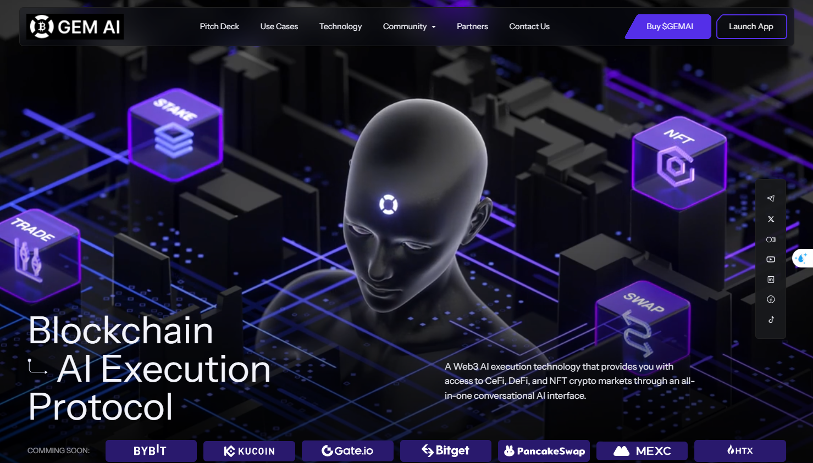

# Introduction

GEM AI Protocol is a Web3 AI-powered investment protocol, designed as an AI conversational interface for CeFi, DeF, NFT investments, AI trading and AI portfolio management.

<figure><figcaption>
GEM AI NETWORK
</figcaption></figure>

**Objective & Market Analysis**

In the rapidly advancing realm of cryptocurrency and blockchain technology, our product is committed to delivering forward-thinking solutions. An analysis of online user demographics highlights a distinct gap: e-commerce boasts a user base of 2.4 billion, whereas the crypto market stands at an approximate 420 million users. This product seeks to address this gap, targeting the primary challenges—technical intricacy, perceived risks, and a potential reluctance to invest time in learning.

**Features & Benefits**

**Smart AI Assistant:** Tailored for e-commerce users, this feature grants a seamless entrance to the crypto domain, enabling purchases and the ability to earn crypto-cashback. Our solution involves leveraging smart voice assistant technology to seamlessly introduce e-commerce users to the crypto market. By making purchases through our application, users can enjoy a conversational ordering experience at their favorite online store and receive a crypto-cashback, which is then staked to generate growth. This approach effectively eliminates the three main barriers to entering the crypto market. It is technically easy, as users go through their familiar online shopping process and receive cryptocurrency as a reward. There is no risk involved, as users receive crypto without any preconditions. Additionally, our solution promotes engagement and learning, as users receive regular reports on the growth of their crypto assets and can access a smart consultant to guide them through the entire investment journey.

**AI Powered Investment Ecosystem:** The whole thing includes various investment products such as trading, copy trading, algorithmic trading, buying tokens, and more depending on the user's level of expertise.

**User Engagement:**We have successfully onboarded 60,000 users, with the aspiration to engage over 100 million in the upcoming years

Our approach is designed to simplify the crypto adoption process, minimizing common barriers like technical setup and complex terminology. And beyond simplicity, we prioritize user safety. Our platform is engineered to provide a robust environment, mitigating potential security threats.

The GEM Al is not just a tool—it's an educational gateway. It aims to simplify crypto adoption, acquainting users with foundational concepts and ensuring continual support throughout their journey.
